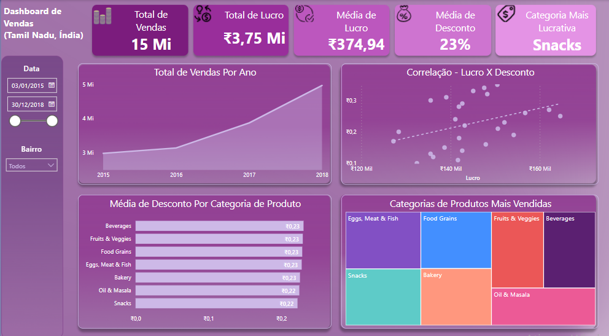

# Dashboard de Vendas em Tamil Nadu, Índia.

   Neste projeto irei expor um painel gráfico relativo às vendas comerciais registradas na cidade de Tamil Nadu localizado nacionalmente na Índia, tal dashboard irá exibir diversas informações atinentes ao comércio, aos lucros, faturamentos e categorias de produtos mais demandados na economia de tal cidade indiana:
   
 
 
Primariamente, em tal painel gráfico foi inserido dois filtros principais para obtermos dados de vendas de Tamil Nadu em relação aos dias, meses ou anos em que tais vendas foram registradas, e o segundo filtro foi aplicado para obtermos dados de vendas relativos aos bairros e regiões inclusas na cidade indiana.

Em relação às vendas coletadas durante esse período temporal de 2015 até 2018, observamos notavelmente que **(1)** foram realizadas 15 milhões de vendas em toda à cidade de Tamil Nadu, e durante esse intervalo de tempo é observável no primeiro gráfico que houve uma tendência de aumento nos números de vendas realizadas na cidade indiana, ou seja, observamos que 2015 foi o ano com menos vendas, e cronologicamente notamos um aumento contínuo de vendas por ano, ao ponto que o pico de vendas foi atingido em 2018.

No total, **(2)** às empresas de Tamil Nadu obtiveram um lucro aproximadamente de 3,75 milhões em rupias indianas, que em conversão para dólares significa que no geral durante os anos de 2015 até 2018, às empresas da cidade indiana obtiveram um lucro próximo à 47 mil dólares, que consideravelmente é um valor baixo, ao considerar-se o lucro de toda uma cidade. 

Em média, **(3)** às empresas de tal cidade obtinham lucros próximos à 375 mil rupias indianas, que em conversão ao dólar representa que em média os lucros das empresas de Tamil Nadu é próximo de 4 mil dólares por venda realizada.

Em média, **(4)** os produtos e serviços vendidos de tal cidade indiana são ofertados estimadamente com um desconto próximo à 23% na compra dos produtos.

Para finalizarmos a exposição analítica dos cartões, temos a informação econômica de que **(5)** lanches são os tipos de produtos mais comprados e demandados na cidade indiana.

Após isto, **(7)** temos um gráfico de dispersão que demonstra haver uma correlação positiva entre as variáveis de lucro e desconto, ou seja, é exposto em tal gráfico de dispersão que se o desconto aumenta, o lucro tende à aumentar correlativamente, logo tal informação poderia ajudar uma empresa na tomada de decisão ao saber que quão maior o desconto, maior o lucro, uma empresa poderia aplicar tal insight para estimular mais descontos nas vendas dos produtos, na expectativa de vender mais, e consequentemente lucrar mais com seus investimentos.

Consequentemente, **(8)** vemos no gráfico de barras horizontais a média de desconto por categoria de produto, e disso afirmamos que ovos, carnes, peixes, bebidas, legumes e lanches são uma das categorias de produtos que são vendidos com os maiores descontos, e **(9)** interessantemente no gráfico de treemap é notável que às categorias de produtos mais vendidas são os tipos de produtos que apresentam em média às maiores taxas de desconto, tal como ovos, carnes, peixes, grãos de comida, lanches e bebidas, são um desses produtos que mais são vendidos, e que também apresentam às mais altas taxas de desconto na cidade de Tamil Nadu.

Por fim, tal painel gráfico traz o principal insight estatístico de que às empresas tendem à lucrar e vender mais produtos, ao colocarem taxas de desconto que gerem estímulos para os consumidores comprarem tais produtos por preços mais baixos e acessíveis, tal informação poderia estimular a equipe de marketing e aos gestores da empresa à buscarem meios além da taxa de desconto, para poderem aumentar às vendas e os lucros da empresa.

